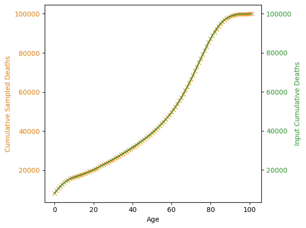

Kaplan-Meier Estimator for Predicting Age/Year of Death
=======================================================

The KaplanMeierEstimator takes an array of cumulative deaths and returns
an object that will sample from the Kaplan-Meier distribution.

A sample input array of cumulative deaths might look like this:

    cd[0] = 687 # 687 deaths in the first year (age 0)
    cd[1] = 733 # +46 deaths in the second year (age 1)
    cd[2] = 767 # +34 deaths in the third year (age 2)
    ...
    cd[100] = 100_000  # 100,000 deaths by end of year 100

predict\_year\_of\_death() takes an array of current ages (in years) and
returns an array of predicted years of death based on the cumulative
deaths input array.

*Note:* predict\_year\_of\_death() can use non-constant width age bins
and will return predictions *by age bin*. In this case, it is up to the
user to convert the returned bin indices to actual years.

A sample non-constant width age bin input array might look like this:

    cd[0] = 340 # 1/2 of first year deaths in the first 3 months
    cd[1] = 510 # another 1/4 (+170) of first year deaths in the next 3 months
    cd[2] = 687 # another 1/4 (+177) of first year deaths in the last 6 months
    cd[3] = 733 # 46 deaths in the second year (age 1)
    cd[4] = 767 # 34 deaths in the third year (age 2)
    ...
    cd[103] = 100_000  # 100,000 deaths by end of year 100

In this example, values returned from predict\_year\_of\_death() would
need to be mapped as follows:

    0 -> (0, 3] months
    1 -> (3, 6] months
    2 -> (6, 12] months
    3 -> 1 year
    4 -> 2 years
    ...
    102 -> 100 years

predict\_age\_at\_death() takes an array of current ages (in days) and
returns an array of predicted ages (in days) at death. The
implementation assumes that the cumulative deaths input array to the
estimator represents one year age bins. If you are using non-constant
width age bins, you should manually convert bin indices returned from
predict\_year\_of\_death() to ages.

Example
-------

``` {.sourceCode .python}
from laser_core.demographics import KaplanMeierEstimator

estimator = KaplanMeierEstimator(cumulative)
nagents = 100_000
dobs = np.zeros(nagents)    # dates of birth, newborns = 0
dods = estimator.predict_age_at_death(dobs, max_year=100)   # dates of death in days
```


