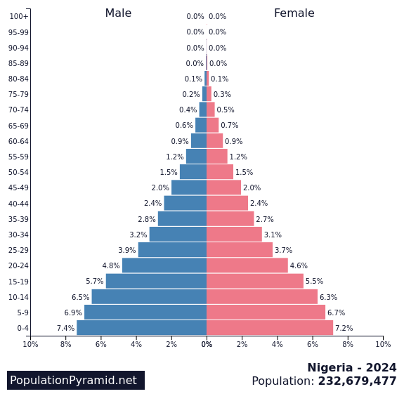
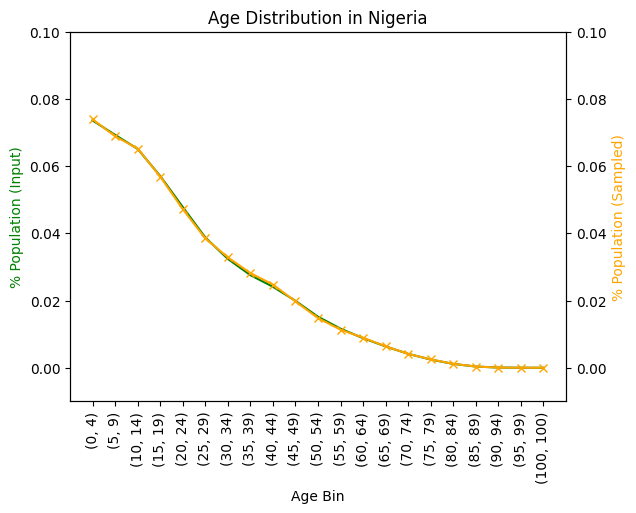

Population Pyramids
===================

The AliasedDistribution class provides a way to sample from a set of
options with unequal probabilities, e.g., a population pyramid.

The input to the AliasedDistribution constructor is an array of counts
by bin as we would naturally get from a population pyramid (\# of people
in each age bin).

AliasedDistribution.sample() returns *bin indices* so it is up to the
user to convert the values returned from sample() to actual ages.

Expected format of the population pyramid CSV file for
\`load\_pyramid\_csv()::

    Header: Age,M,F
    start-end,\#males,\#females
    start-end,\#males,\#females
    start-end,\#males,\#females
    ...
    start-end,\#males,\#females
    max+,\#males,\#females

E.g.::

    Age,M,F
    0-4,9596708,9175309
    5-9,10361680,9904126
    10-14,10781688,10274310
    15-19,11448281,10950664
    ...
    90-94,757034,1281854
    95-99,172530,361883
    100+,27665,76635


load\_pyramid\_csv()\` returns a 4 column NumPy array with the following
columns:

    0 - Lower bound of age bin, inclusive
    1 - Upper bound of age bin, inclusive
    2 - number of males in the age bin
    3 - number of females in the age bin

Example
-------

``` {.sourceCode .python}
import numpy as np
from laser_core.demographics import load_pyramid_csv, AliasedDistribution
import importlib.util
import os

MCOL = 2
FCOL = 3

MINCOL = 0
MAXCOL = 1

# Access the bundled file dynamically
laser_core_path = importlib.util.find_spec("laser_core").origin
laser_core_dir = os.path.dirname(laser_core_path)
pyramid_file = os.path.join(laser_core_dir, "data/us-pyramid-2023.csv")

pyramid = load_pyramid_csv(pyramid_file)
sampler = AliasedDistribution(pyramid[:, MCOL])    # We'll use the male population in this example.
n_agents = 100_000
samples = sampler.sample(n_agents)              # Sample 100,000 people from the distribution.
# samples will be bin indices, so we need to convert them to ages.
bin_min_age_days = pyramid[:, MINCOL] * 365          # minimum age for bin, in days (include this value)
bin_max_age_days = (pyramid[:, MAXCOL] + 1) * 365    # maximum age for bin, in days (exclude this value)
mask = np.zeros(n_agents, dtype=bool)
ages = np.zeros(n_agents, dtype=np.int32)
for i in range(len(pyramid)):   # for each possible bin value...
    mask[:] = samples == i      # ...find the agents that belong to this bin
    # ...and assign a random age, in days, within the bin
    ages[mask] = np.random.randint(bin_min_age_days[i], bin_max_age_days[i], mask.sum())

# in some LASER models we convert current ages to dates of birth by negating the age
# dob = -ages
```

Nigeria
-------

The population pyramid for Nigeria is available from \<TBD\>.

Source: <https://www.populationpyramid.net/nigeria/2024/>




