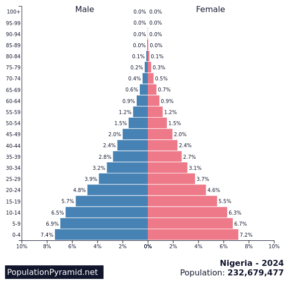
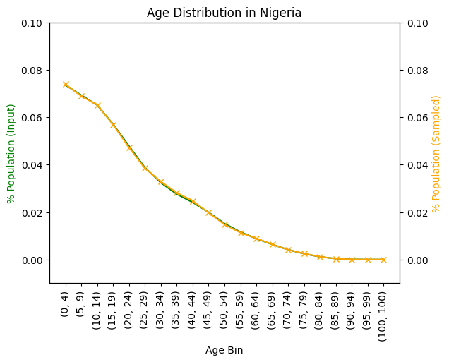

Population Pyramids
===================

The `AliasedDistribution` class provides a way to sample from a set of options
with unequal probabilities, e.g., a population pyramid.

The input to the `AliasedDistribution` constructor is an array of counts by bin
as we would naturally get from a population pyramid (# of people in each age bin).

`AliasedDistribution.sample()` returns *bin indices* so it is up to the user to
convert the values returned from `sample()` to actual ages.

Expected format of the population pyramid CSV file for `load_pyramid_csv()`::

    Header: Age,M,F
    start-end,#males,#females
    start-end,#males,#females
    start-end,#males,#females
    …
    start-end,#males,#females
    max+,#males,#females

E.g.::

    Age,M,F
    0-4,9596708,9175309
    5-9,10361680,9904126
    10-14,10781688,10274310
    15-19,11448281,10950664
    …
    90-94,757034,1281854
    95-99,172530,361883
    100+,27665,76635

`load_pyramid_csv()` returns a 4 column NumPy array with the following columns::

    0 - Lower bound of age bin, inclusive
    1 - Upper bound of age bin, inclusive
    2 - number of males in the age bin
    3 - number of females in the age bin

Example
-------

.. code-block:: python

    import numpy as np
    from laser_core.demographics import load_pyramid_csv, AliasedDistribution
    import importlib.util
    import os

    MCOL = 2
    FCOL = 3

    MINCOL = 0
    MAXCOL = 1

    # Access the bundled file dynamically
    laser_core_path = importlib.util.find_spec("laser_core").origin
    laser_core_dir = os.path.dirname(laser_core_path)
    pyramid_file = os.path.join(laser_core_dir, "data/us-pyramid-2023.csv")

    pyramid = load_pyramid_csv(pyramid_file)
    sampler = AliasedDistribution(pyramid[:, MCOL])    # We'll use the male population in this example.
    n_agents = 100_000
    samples = sampler.sample(n_agents)              # Sample 100,000 people from the distribution.
    # samples will be bin indices, so we need to convert them to ages.
    bin_min_age_days = pyramid[:, MINCOL] * 365          # minimum age for bin, in days (include this value)
    bin_max_age_days = (pyramid[:, MAXCOL] + 1) * 365    # maximum age for bin, in days (exclude this value)
    mask = np.zeros(n_agents, dtype=bool)
    ages = np.zeros(n_agents, dtype=np.int32)
    for i in range(len(pyramid)):   # for each possible bin value...
        mask[:] = samples == i      # ...find the agents that belong to this bin
        # ...and assign a random age, in days, within the bin
        ages[mask] = np.random.randint(bin_min_age_days[i], bin_max_age_days[i], mask.sum())

    # in some LASER models we convert current ages to dates of birth by negating the age
    # dob = -ages

Nigeria
-------

The population pyramid for Nigeria is available from <TBD>.

Source: https://www.populationpyramid.net/nigeria/2024/

