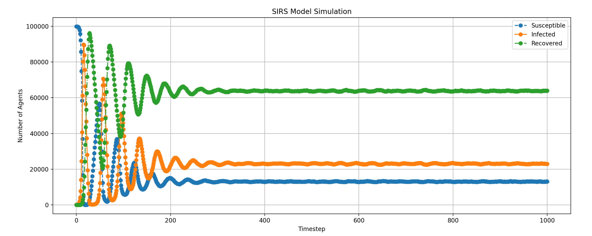
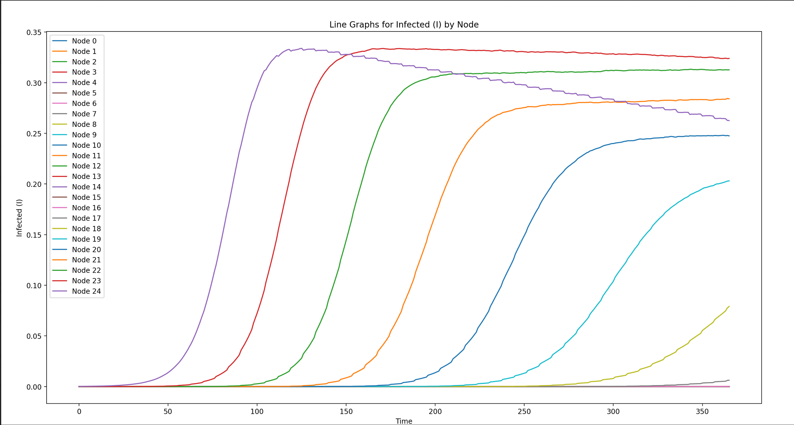

# 1e6 SQL SEIRS Model

## Single node (for now)

### Quick Intro
This model explores the idea and limits of creating a disease model entirely in SQL. Using Python & SQLite, to get started. 

Every row is an agent. Every column is an attribute. Every calculation is done as a SQL operation.

Note that plotting is a separate step.

SQL is SQLite for now. Going to compare with Polars soon.

## 1e7 Numpy SEIRS Spatial Model

### Summary
This model has 10 million agents, and 25 nodes. The population varies across the nodes, with population proportional to the node index. We seed the infection in node 25. We migrate 1% of infecteds "down" to the next node counting down. Here we plot just the top 25 nodes. We see infection spread from node to node. Incubation lasts 2 days. Infection last a week on average with some spread. Immunity lasts a month on average with some spread.

The simulation runs in a few minutes. I've done a 250 node one also which runs quickly if prevalence is low. Don't have any real eye-candy associated with that experiment yet.

This model was started in SQL but converted to numpy. 

99% of the coding (Python, SQLite, and numpy) was actually done with ChatGPT.

### What is a "SQL Model"?

Nothing more than a dataframe model. The entire model (at this point) is a single table or dataframe. Every agent is a row. Every attribute is a column. For example:

|id|node|age|infected|infection_timer|incubation_timer|immunity|immunity_timer|
|--|----|---|--------|---------------|----------------|--------|--------------|
|1|24|72.0|0|0|0|0|0|
|2|17|62.0|0|0|0|0|0|
|3|19|40.0|0|0|0|0|0|
|4|19|55.0|0|0|0|0|0|
|5|23|34.0|0|0|0|0|0|
|6|19|72.0|0|0|0|0|0|
|7|23|33.0|0|0|0|0|0|
|8|7|25.0|0|0|0|0|0|
|9|4|16.0|0|0|0|0|0|
|10|20|89.0|0|0|0|0|0|

Some advantages of this are:
- Dataframes are easy to intuit.
- The entire state of the model can be inspected using your preferred tabular data processing tools (SQL, Pandas, R).
- Serialization to/from csv files comes for free.
- Updating model state can be done via high performing tabular data manipulation tools (e.g., SQL, numpy, Pandas).
- It's almost trivial to go to and from SQL-based processing and numpy.

More soon...
